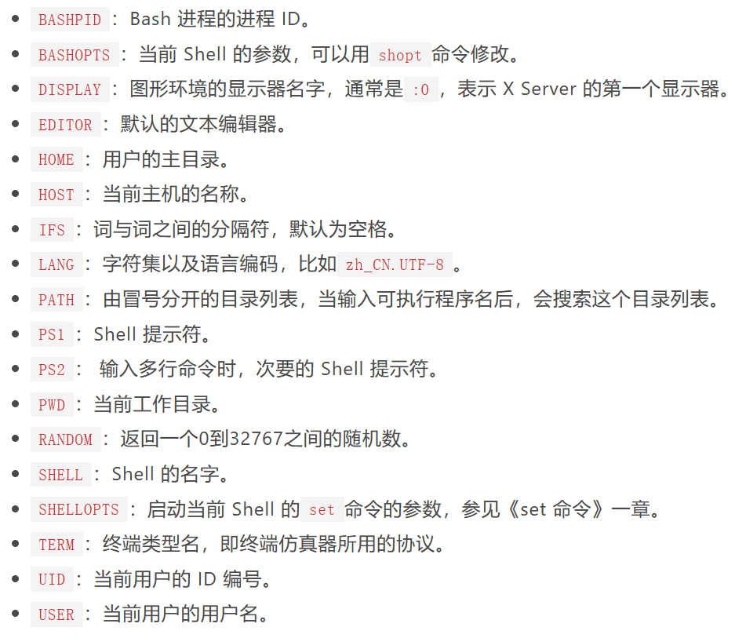

# bash笔记
本文的原教程来自[这里](https://wangdoc.com/bash)
## 格式
bash指令的格式一般为：
``` bash
$ command -参数
```
这里的参数是短形式（简写），全写也可写为：
```bash
$ command --参数（全称）
```
如果指令有不同输入，用空格间隔即可
分号可以间隔不同语句，可以在一行中写多个语句
```bash
$ clear; ls
```

## 语法
### 文件名扩展
```bash
$ command1 && command2
#当command1执行成功后才执行command2
$ command1 || command2
#当command1执行失败后执行command2
$ echo ~
#上文中的~会被bash补全为目录
$ echo ~/dir
#上文中的dir是子目录，可以输出子目录地址
$ echo ~党晨益
#输出某一用户的主目录
$ echo ~+
#输出目前所在的目录
$ ls ?.txt
#?可以替代任何单个非空字符，连用即可代替多个字符，每个汉字是一个字符。如果无法找到匹配，则把?原样输出
$ ls *.txt
#*可以替代任意数量的字符（包括空字符），如ls *b*可以输出b.txt/b.png/ab.txt
$ ls .*
#匹配所有隐藏文件
$ ls */*.txt
#匹配所有子目录下的文件
$ ls [ab].txt
#匹配所有文件名是a或b的文件
$ ls [!ab].txt
#匹配所有文件名不是a或b的文件
$ ls [a-c].txt
#匹配所有文件名处于a与c之间（即a/b/c）的文件
$ ls [a-zA-Z0-9].*
#匹配所有不含特殊字符且文件名只有一个字符的文件，前面加感叹号可以表示不在该范围内的文件
$ echo d{a,e,i,u,o}g
#输出dag deg dig dug dog，大括号扩展所有其中的内容，逗号前后不能有空格，大括号可以嵌套，可以联动其他语法且总是最先被扩展
$ echo .{mp{3..4},m4{a,b,p,v}}
#输出.mp3 .mp4 .m4a .m4b .m4p .m4v，其中的..是大括号的扩展，类似中括号的-常见用途为新建一系列目录。
$ for i in {1..4}
do
  echo $i
done
#也常用与循环中，用于划定范围（$i表示取变量i的值）
$ echo {01..5}
#如果整数前面有0，输出所有的数都有前置0，即01/02/03/04/05
$ echo {0..8..2}
#两个..可以指定步长，即输出0/2/4/6/8
$ echo {0..3}{0..3}
#多个大括号连用表示嵌套循环，就跟两个for循环嵌套一样
$ echo $SHELL
#bash将$符号后面的视为变量并读取其内容，${!string*}或${!string@}返回所有匹配给定字符串string的变量名。
$ echo $(date)
#$符号后面加括号可以将一个函数的运行结果作为输入。本例输出当前时间。这种结构可以嵌套。
$ echo $((1+1))
#后面加两个括号可以将算数运算的值作为参数
$ ls [[:upper:]]*
#本语句输出所有以大写字母开头的文件名。第一个大括号后面加感叹号可以输出不符合条件的文件。更多扩展见参考文献。

```
按tab可以补全一段命令，若有多种选择可以按两次，将会输出所有可能选择

---
### 字符转义
bash使用\进行转义，可选搭配包括：

\a:响铃

\b:退格

\n:换行

\r:回车

\t:制表符

```bash
$ echo -e "a\tb"
#输出a       b
```
单引号中的所有字符会被直接输出而不经过解释。
```bash
$ echo '$SHELL'
#输出$SHELL
```
双引号也会将大多数特殊字符的含义取消，只有*、\、`除外。双引号常用与文件名包含空格、命令需要写多行等情况。另外，双引号括起来的内容可以显示原文而不是单行显示
```bash
$ echo "'date'"
#输出时间。反引号用于执行子命令
$ echo "cal"
#以原始格式输出日历(当然了，如果有这个函数的话)
```

---
### here文档
here文档用于输入多行文本。只有可以接受标准文档输入的函数才能接受here文档（如echo就不行）。它只能作为参数而不能作为变量。
```bash
$ foo='hello world'
$ cat << '_example_'
$foo
"$foo"
'$foo'
_example_
#上面的指令将会输出
#$foo
#"$foo"
#'$foo'
#因为单引号内的here名称将不会解析其中的文本。若上文中的_example_不放在单引号内，输出：
#hello world
#"hello world"
#'hello world'
```
它的变种here字符串也可用于将字符串通过标准输入传入参数：
```bash
$ cat <<< 'hi there'
#等同于echo "hi there" | cat,输出hi there
```

---
### 变量
#### 环境变量
环境变量是bash定义好的变量，可以直接使用。可以使用env命令输出所有环境变量。
常见的环境变量如下图：

查看单个变量的值可以用printenv命令或echo
#### 自定义变量
自定义变量是允许用户自定义的变量，只在当前SHELL可用，一旦退出SHELL就会析构。使用set命令以显示所有变量以及函数（超级长）。
#### 创建变量
创建变量的格式为variablename=value.变量名只能包含数字、字母与下划线，且首个字符不能为数字。变量的值可以包含空格，但当然要放在双引号里。对于有连续空格内容的变量，应当使用"$variablename"读取。
```bash
$ TEST="new name"
#通常习惯性将变量名命名为大写
$ TEST1=((1+2));TEST2=$(ls -l foo.txt)
#同一行命名多个变量时用分号隔开，变量的赋值可以是函数的返回值或算式。
$ ls ${a}_file;
#通过加大括号避免$符号读取后面的其他内容。
$ TEST3=TEST
$ echo ${!TEST3}
#通过加感叹号访问变量的最终值，否则输出TEST

```
#### 删除变量
bash中删除变量实际上就是将这个变量设为空字符串，因此可以采用这几种方法：
```bash
$ unset TEST
$ TEST=''
$ TEST=
```
#### 输出变量
bash中的子shell无法读取到父shell的变量。为了让它能够读取，可以将变量export：
```bash
$ export TEST="new name"
#将定义与输出在同一步完成
#完整的输出与继承流程如下：
# 输出变量 $foo
$ export foo=bar

# 新建子 Shell
$ bash

# 读取 $foo
$ echo $foo
bar

# 修改继承的变量
$ foo=baz

# 退出子 Shell
$ exit

# 读取 $foo，子shell中的更改不会影响父shell，正如CPP里的函数一样
$ echo $foo
bar
```
#### 一些特殊变量
bash提供了一些特殊变量，它们不能被赋值：

1. $?：指示前一个指令是否执行成功，是的话为零，否则不为零。
2. \$$：输出当前进程的进程ID，常用于命名文件。
3. $_：输出上一个命令的最后一个参数。
4. $!：输出上一个异步线程的进程ID。
5. $0：输出当前SHELL名称或脚本名。
6. $-：输出当前SHELL的启动参数。
## 指令
### echo
``` bash
$ echo hello world
#有时为了简洁会分行写，但是正常情况下按回车就会执行，因此可以：
$ echo hello \
world
#跟上面输出一样
```
 echo后面的参数可以是-n/-e,分别表示取消末尾自动换行以及解释引号中的特殊内容， 如：
``` bash
$ echo -e "hello\nworld"
```
输出:

hello

world

---
### type
type命令用于检测某一函数是否为bash内置的命令
```bash
$ type echo
#输出echo is a shell builtin
```
参数可以是-a,输出所有定义，-t,输出类型

---
### touch
touch命令用于创建或打开一个文件（mkdir用于创建一个新目录）,或更新文件的时间戳。用法如：
```bash
# 创建一个新文件
touch newfile.txt

# 创建一个新文件，并设置修改时间为当前时间
touch -m newfile.txt

# 创建一个新文件，并设置访问时间和修改时间为2023年1月1日0时0分0秒
touch -a -m -d "2023-01-01 00:00:00" newfile.txt

# 修改现有文件的时间戳
touch -t 202301010000.txt existingfile.txt
```
---
### shopt 
shopt命令用于控制bash选项，其中包括：
1. extglob：启用更复杂的模式匹配。
2. braceexpand：启用花括号展开，允许使用花括号来扩展命令列表。
3. autocd：自动切换到匹配的目录（当使用 cd 命令跟在一个路径后面时）。
4. hash_mail：启用邮件命令的哈希表功能，以提高邮件处理的效率。
5. mail_warning：在邮件文件超过警告大小时发出警告。
6. cdable_vars：允许变量名中包含 cd 命令，这样的变量可以作为目录切换。
7. nocasematch：忽略 case 命令中的大小写差异。
8. nocaseglob:忽略文件匹配中的大小写差异
9. nullglob：匹配空文件名时不要展开，而是输出空字符
10. progcomp：程序完成功能，允许 complete 命令使用程序来确定补全的命令。
11. smartcase：在处理大小写敏感的匹配时，智能地处理大小写。
12. dotglob:允许匹配隐藏文件
13. failgolb:当没有匹配到目标时报错而不是原样输出
14. globstar:可以用**表示多级子目录，而不是写很多次
    
具体使用方法如下：
```bash
$ shopt -s
#输出所有选项的开启和关闭状态
$ shopt -s name
#开启某一个选项
$ shopt -u name
#关闭某一个选项
```
上面的选项的具体内容如下：
#### extglob
```bash
$ ls abc?(.)txt
#问号后面加括号可以匹配一个或零个其中内容，即abctxt与abc.txt
$ ls abc@(.txt|.cpp)
#匹配.txt或.cpp文件
$ ls abc+(.txt)
#匹配包含一个或多个括号中内容的文件，如abc.txt和abc.txt.txt均可
$ ls ab!(c).txt
#匹配不为abc.txt的文件
```